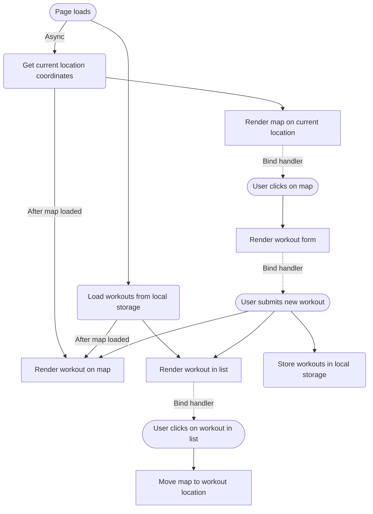
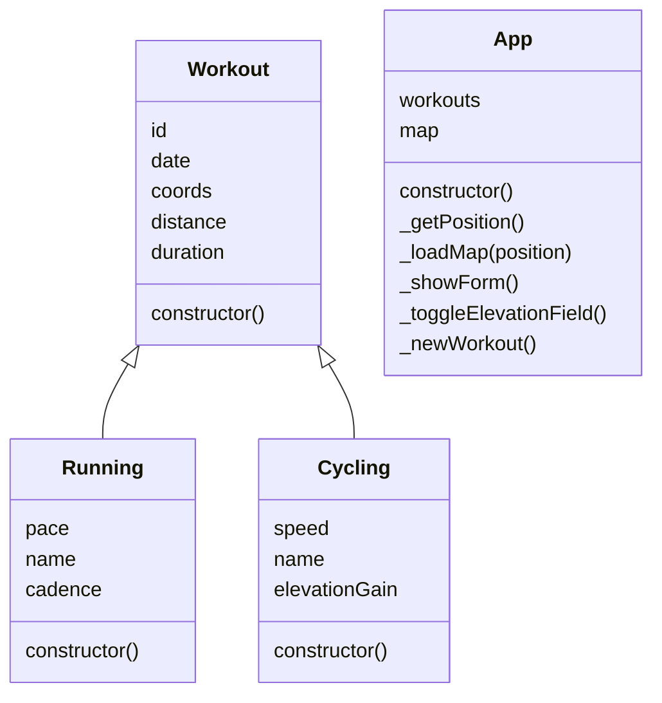

# MAPTY

###### \*Mapty is one project I learned from [Jonas Schmedtmann](https://www.udemy.com/course/the-complete-javascript-course/?referralCode=87FE8B1039A68106DEE5).

## BRIEF

An app maps your workouts | [**DEMO**](https://howiework.github.io/Mapty/)

&nbsp;

## KEYWORDS

OOP, Geolocation, External libraries, Project planning

&nbsp;

## FEATURES

### Interactive Map

- Indicate current location (Geolocation)
- Add new workouts
- Display all workouts on the map

### User Form

- Input distance, time, (pace, steps/minute), (speed, elevation gain)

### Interactive Workout List

- Display all workouts in the list
- Move map to workout location on click

### Workout data in the browser (Local storage API)

- Store workout data
- Read the saved data from local storage and display on page load

###### FIXME-highlight: NEW features I implemented (as challenges); \* FIXME-highlight: original features from the course;

&nbsp;

## TRACKING (TDL)

### Stage I

- [x] Project set-up
- [ ] Project planning
  - [x] User Stories
  - [x] Features
  - [x] Flowchart
  - [ ] Architecture
- [x] Use Geolocation API
- [x] Display a map using Leaflet Library
- [x] Display a map marker
- [x] Render workout input form
- [x] Project architecture
- [x] Refactor based on architecture
- [x] Manage workout data (create Classes)
- [x] Create a new workout
- [x] Render workouts
- [x] Move to marker on click
- [ ] Work with localStorage
- [ ] Stage II preparation

### Stage II

- [ ] TBD

&nbsp;

## DETAILS

### User Stories

<!-- prettier-ignore-start -->
| WHO | WHAT | WHY |
| --- | ---- | --- |
| User 1 | Log **running** workouts with `location`, `distance`, `time`, `pace` and `steps/minut` | Keep a log of all my running |
| User 2 | Log **cycling** workouts with `location`, `distance`, `time`, `speed` and `elevation gain` | Keep a log of all my cycling |
| User 3 | See all my workouts at a glance | Easily track my progress over time |
| User 4 | See my workouts on a map | Check where I work out the most |
| User 5 | See all my workouts when I leave the app and come back later | Keep using the app over time |
<!-- prettier-ignore-end -->

### Flowchart

### Architecture

